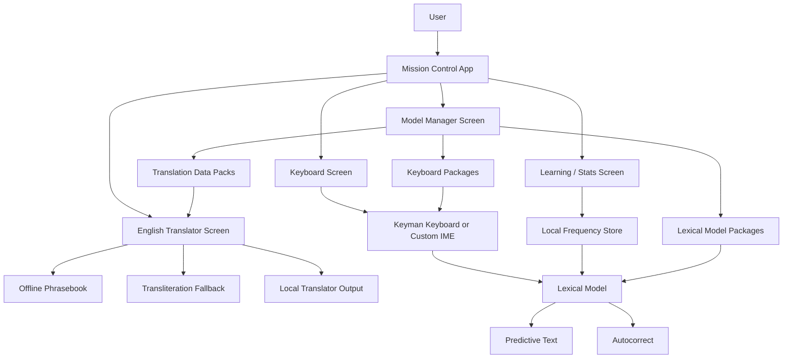
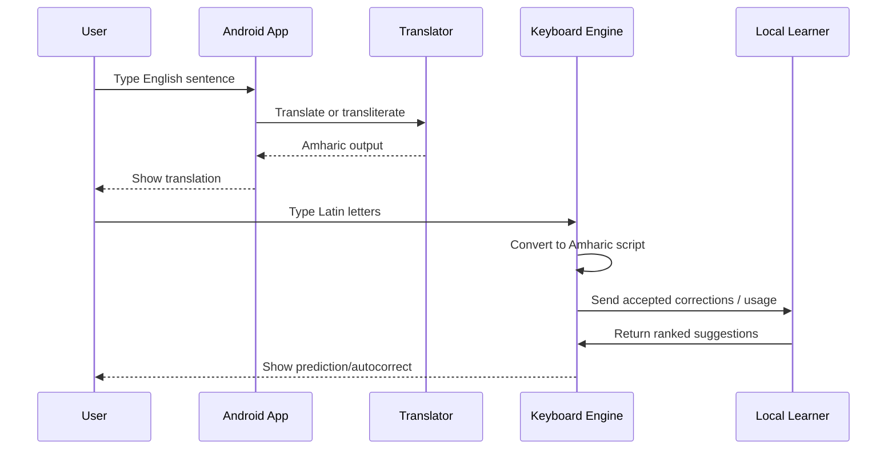

# Architecture

## Goal

Build **Amharic Offline Translator** as a two-layer product:

1. **Mission Control App**  
   A Kotlin Android app that manages translation, learning, keyboard setup, stats, and model updates.

2. **Strong Keyboard Layer**  
   A Keyman-based or Keyman-inspired typing engine that converts English typing into Amharic characters and offers predictions/autocorrect.

The app should stay **offline-first**, with any learning stored locally on the device.

## Core Idea

English typing and Amharic translation are not the same problem:

- **Keyboard/input layer**: turns typed Latin letters into Amharic script while the user types.
- **Translation layer**: converts full English phrases or sentences into Amharic.
- **Learning layer**: remembers what the user accepts and improves local suggestions over time.
- **Mission control app**: manages all of this from one place.

## Recommended Architecture



## Layer Breakdown

### 1. Mission Control App

This is the main Android app the user opens first.

Responsibilities:

- show English-to-Amharic translation
- show live keyboard preview
- show learned words and phrases
- let the user train or reset the local learner
- manage keyboard install/download
- manage data packs
- show offline status and version info

Recommended screens:

- Home / Dashboard
- Translate
- Keyboard Lab
- Smart Autocorrect
- Model Manager
- Settings

### 2. Keyboard Layer

This is the strongest long-term path for the typing experience.

Why this matters:

- users who want to type Amharic usually expect instant character conversion
- a keyboard engine is better than forcing translation for every keystroke
- keyboard prediction and autocorrect feel natural when they are built into the input method

Recommended options:

1. **Keyman Engine**
   - best if you want a mature keyboard platform
   - supports in-app and system-wide keyboards
   - supports lexical models for prediction and autocorrect

2. **Custom Android IME**
   - more work
   - more control
   - good fallback if you later outgrow Keyman

Recommended path:

- start with **Keyman**
- keep the app structured so the keyboard engine can be swapped later if needed

### 3. Learning Layer

This is the “small AI” part.

Keep it local and simple at first:

- count accepted words
- count accepted phrases
- track common next-word pairs
- rank suggestions using local frequency

Behavior:

- when the user accepts a translation or a keyboard suggestion, record it
- use that history to improve future predictions
- store everything locally in app storage

This makes the app feel smarter without needing a heavy cloud model.

### 4. Translation Layer

Keep translation separate from keyboard typing.

For MVP:

- use a phrasebook for high-confidence matches
- use transliteration fallback for unknown inputs
- optionally add a lightweight offline translation model later

For later:

- train a better translation model on a PC
- export a mobile-friendly model for on-device inference

## Data Sources

Use curated, open datasets instead of random web scraping.

Good sources to evaluate:

- [Keyman Engine for Android](https://help.keyman.com/developer/engine/android/)
- [Keyman lexical models](https://help.keyman.com/developer/current-version/guides/lexical-models/)
- [English-Amharic sentence pairs from OPUS MT560 on Hugging Face](https://huggingface.co/datasets/michsethowusu/english-amharic_sentence-pairs_mt560)
- [FLORES English-Amharic benchmark dataset on Hugging Face](https://huggingface.co/datasets/rasyosef/flores_english_amharic_mt)

Use these for:

- translation training
- evaluation
- wordlist creation
- prediction dictionary building

## Data Flow



## Suggested Repo Structure

```text
android/
  app/
    src/main/java/dev/amharictranslator/
      MainActivity.kt
      data/
        AmharicTranslator.kt
        SmartLearningEngine.kt
        KeyboardModelManager.kt
      keyboard/
        KeymanBridge.kt
      ui/
        screens/
        components/
      ui/theme/
```

## Training Strategy

### Phase 1

- phrasebook and transliteration
- local learning from accepted phrases
- simple word-frequency ranking

### Phase 2

- Keyman keyboard integration
- lexical model for autocorrect and prediction
- better next-word ranking

### Phase 3

- train or fine-tune translation data on PC
- export a small mobile-friendly model
- keep the phone app as inference and control only

## What the App Should Become

The final product should feel like a **mission control center**:

- user opens the app
- sees translation
- opens keyboard setup
- loads prediction packs
- trains local learning from usage
- checks model health and version
- manages offline packs in one place

## What Not to Do

- do not scrape random copyrighted text from the web
- do not mix translation, keyboard logic, and learning into one class
- do not depend on the network for core typing
- do not start with a huge on-device model
- do not train from scratch before you have good data and a stable keyboard flow

## Next Build Step

The next implementation milestone should be:

1. add a **Keyman integration layer**
2. keep the current translator as the offline fallback
3. connect the learning engine to the keyboard suggestions
4. add a Model Manager screen for packs and status

## Sources

- [Keyman Engine for Android](https://help.keyman.com/developer/engine/android/)
- [Keyman lexical models](https://help.keyman.com/developer/current-version/guides/lexical-models/)
- [OPUS MT560 English-Amharic dataset](https://huggingface.co/datasets/michsethowusu/english-amharic_sentence-pairs_mt560)
- [FLORES English-Amharic dataset](https://huggingface.co/datasets/rasyosef/flores_english_amharic_mt)
